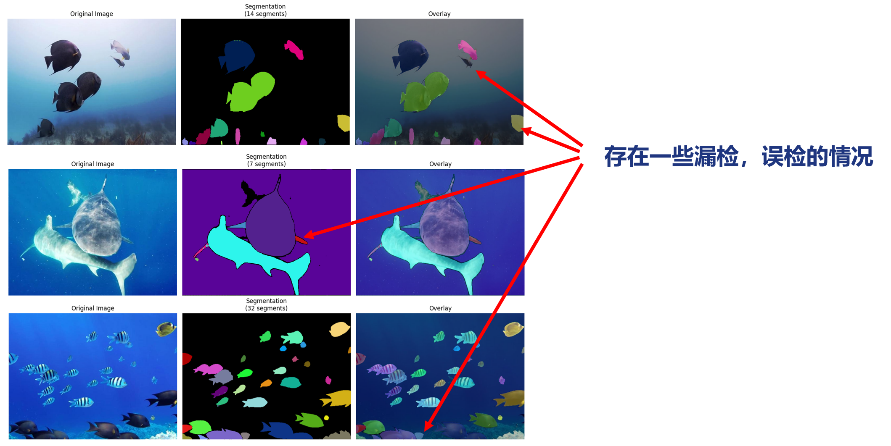
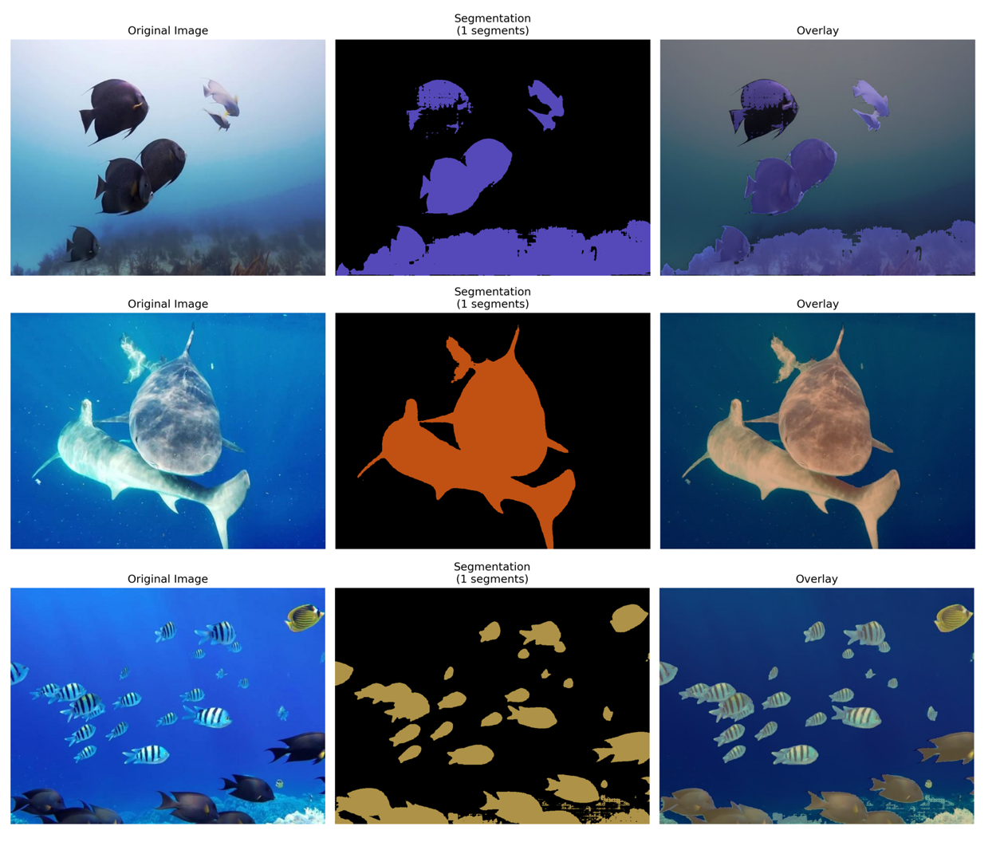
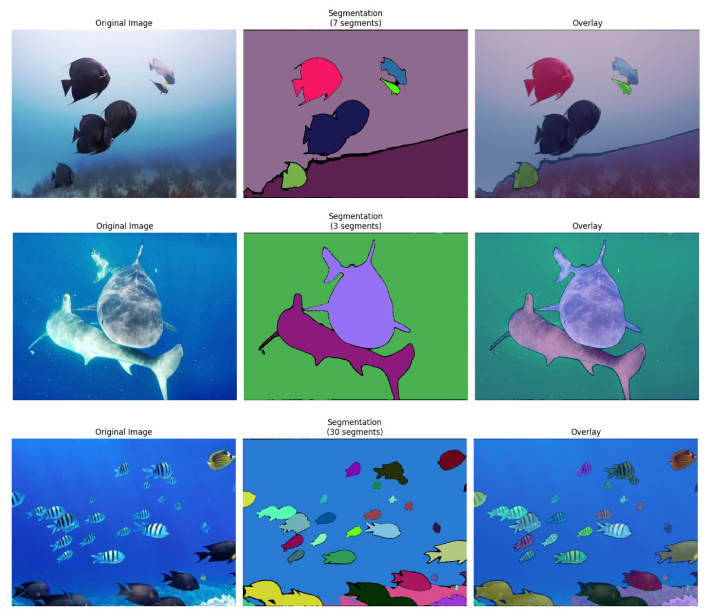
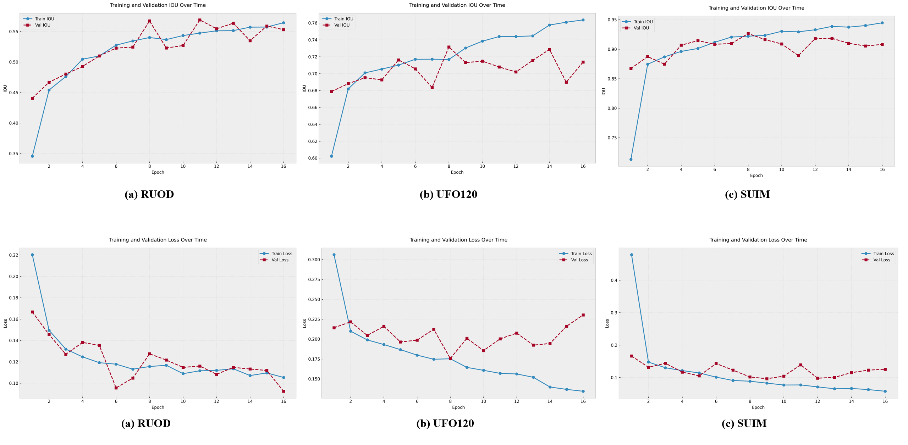

# Marine-SAM

### 一、SAM_ORI

> 这是 SAM 的原始版本，未微调

#### 1.1 运行方法

```bash
# 环境配置方法
conda create -n SAM_ORI python==3.11 -y
conda activate SAM_ORI
cd D:\BISTU\Graduation_Project\Marine-SAM\SAM_ORI

pip install -e .
pip install opencv-python pycocotools matplotlib onnxruntime onnx -i https://mirrors.aliyun.com/pypi/simple
pip3 install torch==2.5.1+cu121 torchvision==0.20.1+cu121 torchaudio==2.5.1+cu121 -i https://download.pytorch.org/whl/cu121
```

单张图片执行：直接运行 `python main.py` 即可，记得更改代码中的图片路径

#### 1.2 效果展示



### 二、SAM2_FT

> 这是 SAM2 分别在 RUOD, UFO120, SUIM 数据集上进行了微调的版本

#### 2.1 运行方法

```bash
# 有 NVIDIA GPU 的 Linux 环境可正常配置环境，不推荐使用 Windows 环境配置
conda create -n SAM2 python=3.11 -y
conda activate SAM2
pip install numpy
pip install -e .
pip install opencv-python pycocotools matplotlib onnxruntime onnx
```

单张图片执行：直接运行 `python TEST_Net_<dataset_name>.py` 即可，记得更改代码中的图片路径

#### 2.2 效果展示





#### 2.3 微调过程


